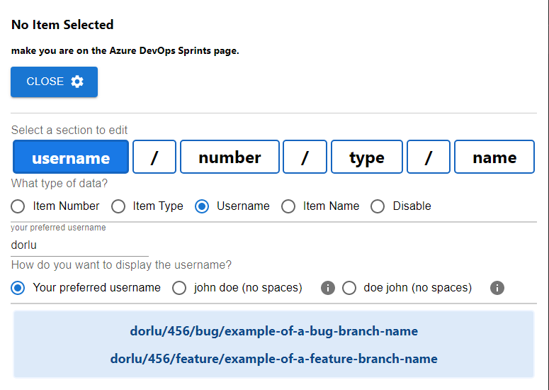

# Azure DevOps Branch Generator Extension
Disclaimer: the code is by no means an example of best practices nor clean code, it was implemented quickly and dirty using copilot.
## Overview

This is a simple extension that allows you to generate a branch name based on an Azure DevOps Board item.  
Tech stack:

- React 18
- WebPack 5

## Local Installation

For local use clone this repository, and run:

```bash
npm install
npm run build
```
this will install every dependencies of the extension and build the extension artifacts inside the `dist` folder.

 you can open the extension section on any chromium based web browser

```text
Edge browser:
edge://extensions/

Chrome Browser:
chrome://extensions/
```

Toggle the `Developer mode` option and then click the `Load unpacked` button, and then select the `dist` folder.

This will add the extension to your browser.

## Configuration

to configure your preffered branch name convention, press the `Settings` button,
and then select each section of the shown section to configure it,  
There are 4 sections and 3 separators inbetween them.

```text
Data sections:
1. Item number - can be fetched from the parent user story or from the current item
2. user name - can be set to be the assignee [firstName][lastName] or [lastName][firstName] or manually insert your prefferred username
3. type - you can change name from feature\task\userstory or bug\bugfix\fix
4. name - this is the name of your item, you can configure separators between each word `\` or `-` or `_`

Separators:
- you can configure separators between each word `\` or `-` or `_` or none of them
```
for every change you make, you can view an example of a bug\feature branch at the bottom of the configutation section.

## Screenshot



## License

This is a free software, you can redistribute it and/or modify it under the terms of the MIT License.
